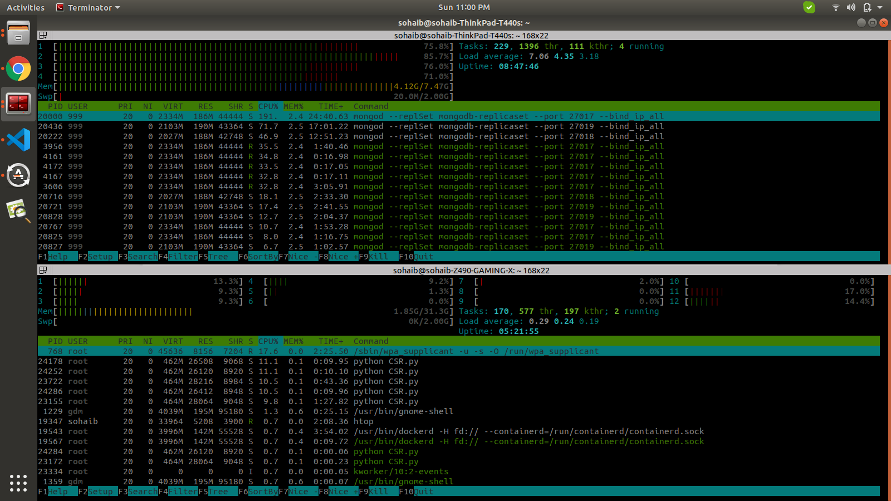

[](https://www.python.org/)
[](http://ansicolortags.readthedocs.io/?badge=latest)


# Introduction

Let's get some hands-on on the docker swarm. Docker swarm is one of the most important things which we would need to use on our production. So let's get started to absorb some new skills.


# Idea
Idea is to make 2 docker files 

* For Mongo
* A python script that will respond to a mongo triggers as soon as possible.

For-example : 
    Suppose I am a client and I just created a request to buy something,I hire docker swarms as a manager which will hire and fire customer sales representatives on the bases of failed tasks. Now as a Bussiness owner (In real i'm a storyteller who is building this story to make this thing excited) I want my docker swarm to manage things so that my every clinet would get response in a minimal time to increase my customer satisfaction. According to resources I have I asked my manager (docker swarm) to hire only 3 CSR at time, **and now comes the boss stage for testing purpose I will do 1000 requests at a single time to see how the manager and CSR will handle those 1000 customer (evil smile). 


# Mongo Server Setup

First we will setup our mongo servers and mongo replicas. We need mongo replicas because it is a requirment of mongo to build replica of database first to listen for triggers. So Lets build Mongo Servers.

1. Pull Mongo Image
```
docker pull mongo:4
```
2. Create Docker Network

```
docker network create mongo-cluster-dev
```
3. Run mongo Containers

```
docker run -d --net mongo-cluster-dev -p 27017:27017 --name mongoset1 mongo:4 mongod --replSet mongodb-replicaset --port 27017
docker run -d --net mongo-cluster-dev -p 27018:27018 --name mongoset2 mongo:4 mongod --replSet mongodb-replicaset --port 27018
docker run -d --net mongo-cluster-dev -p 27019:27019 --name mongoset3 mongo:4 mongod --replSet mongodb-replicaset --port 27019
```
4. Add This to your /etc/hosts file

```
sudo nano /etc/hosts
Append in the end of file:

127.0.0.1       mongoset1 mongoset2 mongoset3

```
5. Add replica information to your primary Node

```
docker exec -it mongoset1 mongo

# Run this after getting into the mongo container

db = (new Mongo('localhost:27017')).getDB('test')
config={"_id":"mongodb-replicaset","members":[{"_id":0,"host":"mongoset1:27017"},{"_id":1,"host":"mongoset2:27018"},{"_id":2,"host":"mongoset3:27019"}]}
rs.initiate(config)

```
You will get results like this

```
{
	"ok" : 1,
	"$clusterTime" : {
		"clusterTime" : Timestamp(1567674525, 1),
		"signature" : {
			"hash" : BinData(0,"AAAAAAAAAAAAAAAAAAAAAAAAAAA="),
			"keyId" : NumberLong(0)
		}
	},
	"operationTime" : Timestamp(1567674525, 1)
}
```
6. Ok Now You can use this string as a connection string

```
mongodb://<hostname>:27017,<hostname>:27018,<hostname>:27019/<Your database name>?replicaSet=mongodb-replicaset

```

7. Test your setup with the help of this notebook  [Testing](Testing.ipynb)


# Python Scripts

Okay! Lets get started with the python scripts. We will make 2 scripts

1. 1st is our CSR (customer sales representative) worker script 
2. 2nd will be the testing script


## CSR Script:
    In this script we will write code to listen mongo insert triggers and perform some opertaion on the inserted mongo-document

## Testing Script:
    This script will helps us to insert, find and delete requests from the mongo database.


## Docker Swarm Creation

Kindly Speceify Mongo Url in env file. Python Script will automatically get the url and run insert triggers on the following database

Pull Docker Image

```
docker pull sohaibanwaar/mongo-triggers-testing
```

Start docker swarm 

```
sudo docker service create --replicas 5 --name mongo -e MONGO_URL="Your Mongo URL" sohaibanwaar/mongo-triggers-testing

```

## Architecture Stats

| No of requests  | Time Taken/sec | Processed Requests | missed requests | docker swarm replicas |
|-|-|-|-|-|
| 1000 | 4.8 | 1000 | 0 | 1 |
| 3000 | 21 | 3000 | 0 | 1 |
| 5000 | 39 | 5000 | 0 | 1 |
| 1000 | 5.8 | 1000 | 0 | 2 |
| 3000 | 24 | 3000 | 0 | 2 |
| 5000 | 47 | 5000 | 0 | 2 |
| 1000 | 7 | 1000 | 0 | 5 |
| 3000 | 29 | 3000 | 0 | 5 |
| 5000 | 67 | 5000 | 0 | 5 |
    

## Resources

Htop on the upper side represents mongo server and on the below on docker swarm replicas of python script are running.




# Helping Materials

1. [Docker Replica Set](https://www.gyanblog.com/docker/how-run-mongodb-replicaset-docker/)
2. [Missing Requests Question](https://stackoverflow.com/questions/68235961/mongo-misses-to-catch-insert-triggers)
3. [Mongo Communication Question](https://stackoverflow.com/questions/68244000/issues-in-communication-of-mongo-db-between-2-servers)
4. [Docker Link](https://hub.docker.com/repository/docker/sohaibanwaar/mongo-triggers-testing)
